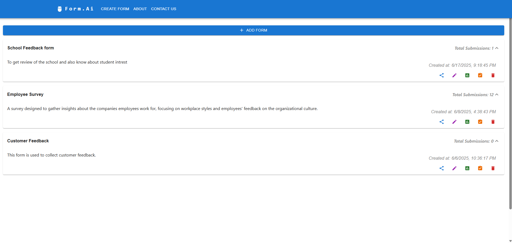
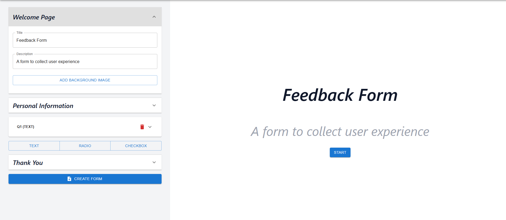
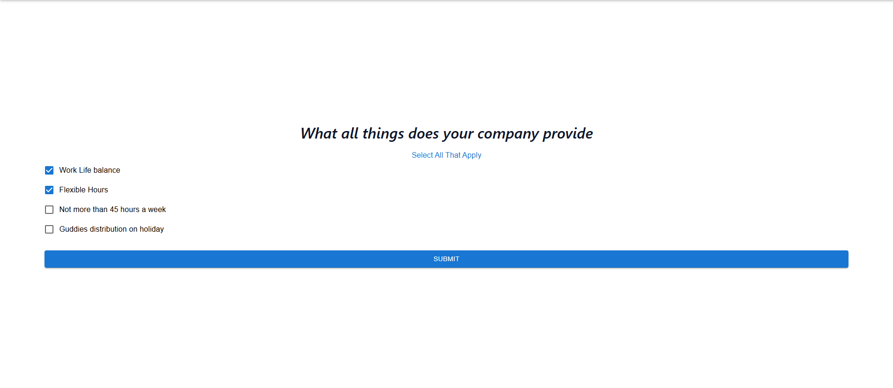
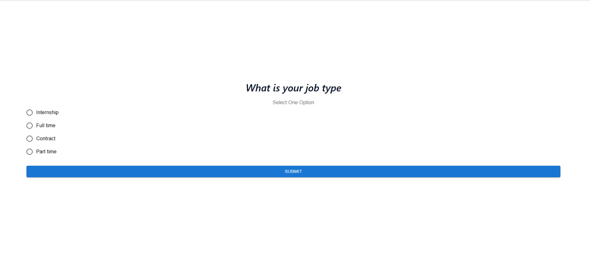
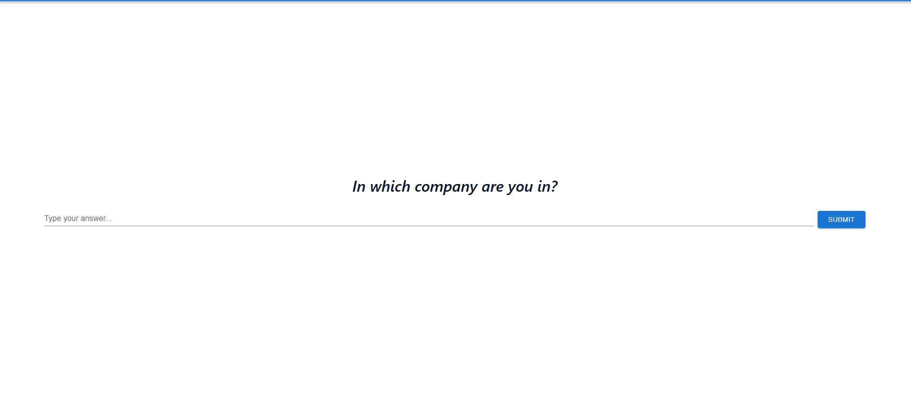
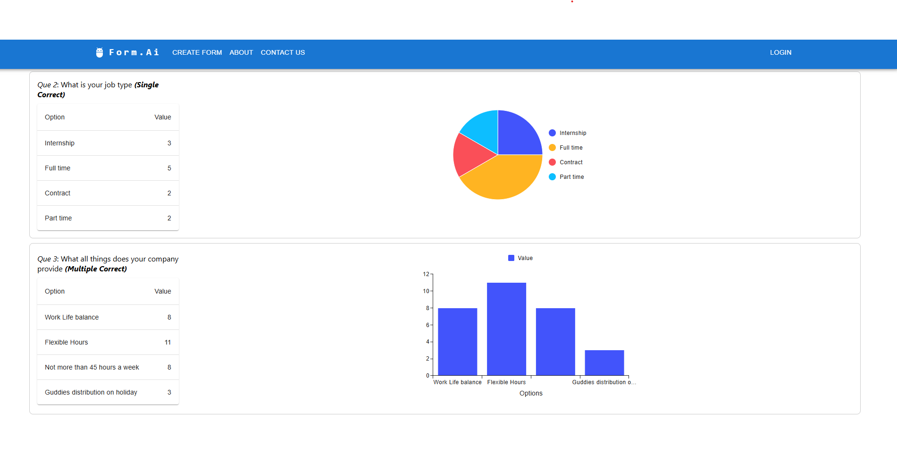

# Form-AI

A dynamic form builder and analytics platform built with React and Material-UI. Form-AI allows users to create customizable forms with various question types, upload images, collect responses, and visualize analytics with interactive charts.

## Features

- **Dynamic Form Builder:** Create forms with text, single choice (radio), and multiple choice (checkbox) questions.
- **Image Uploads:** Add background images to forms and individual questions.
- **Live Preview:** Instantly preview forms as you build them.
- **AI-Powered Personalization:** Uses AI to personalize questions and make communication more interactive for each respondent.
- **Response Collection:** Collect and manage responses from users.
- **Analytics Dashboard:** Visualize response data with interactive bar and pie charts.
- **User Feedback:** Get instant notifications with MUI Snackbar toasts.
- **Responsive Design:** Works seamlessly across devices.

## Tech Stack

- **Frontend:** React, Material-UI (MUI)
- **Charts:** MUI X Charts
- **State Management:** React Hooks
- **API:** RESTful endpoints for form and response management

## Backend

The backend repository for this project is available at:  
[https://github.com/nalin-programmer/Form-AI-Backend](https://github.com/nalin-programmer/Form-AI-Backend)


## Screenshots



**Dashboard:** Overview of all forms and no of submissions.



**Create Form:** Build forms with various question types and add images.


**Opening Page:** The landing page where users start their form journey.



**Multi Correct Question:** Example of a multiple correct answer question.



**Single Correct Question:** Example of a single correct answer question.



**Text Question:** Example of a text input question.


**View Submissions:** See all responses submitted for a form.



**Analytics:** Visualize collected data with interactive charts.

## Getting Started

### Prerequisites

- Node.js (v16+ recommended)
- npm

### Installation

1. Clone the repository:
    ```bash
    git clone https://github.com/yourusername/form-ai.git
    cd form-ai
    ```

2. Install dependencies:
    ```bash
    npm install
    ```

3. Create a `.env` file for API endpoints and image prefix (if needed):
    ```
    VITE_API_BASE_URL=http://localhost:5000/api
    VITE_IMAGE_PREFIX=http://localhost:5000/
    ```

4. Start the development server:
    ```bash
    npm start
    ```

5. Open [http://localhost:3000](http://localhost:3000) in your browser.

## Folder Structure

```
src/
  api/                # API calls
  components/         # Reusable components (form, analytics, etc.)
  pages/              # Page-level components
  styles/             # CSS files
  utils/              # Utility functions and layouts
```

## Usage

- **Create a Form:** Use the form builder to add questions and images.
- **Share & Collect Responses:** Distribute the form link to respondents.
- **View Analytics:** Access the analytics dashboard to visualize collected data.

## Contributing

Pull requests are welcome! For major changes, please open an issue first to discuss what you would like to change.

